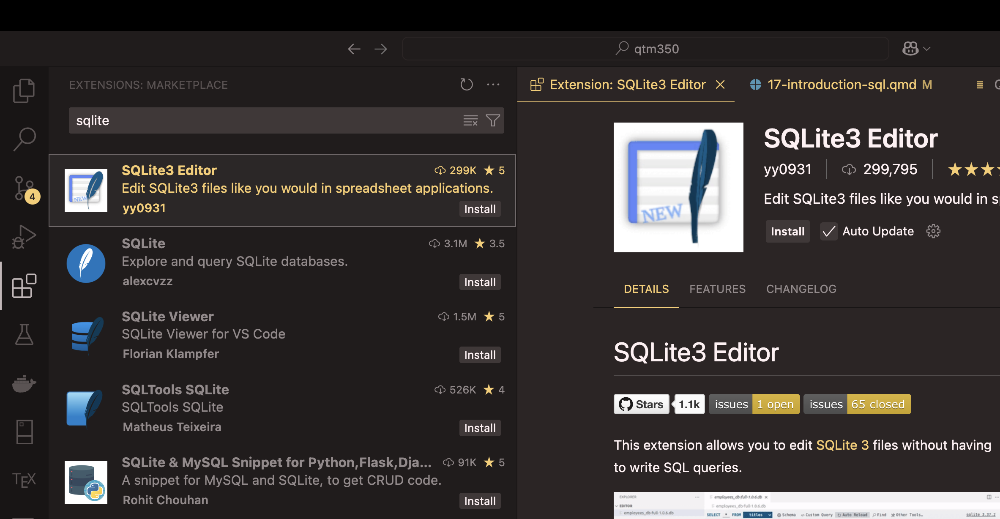
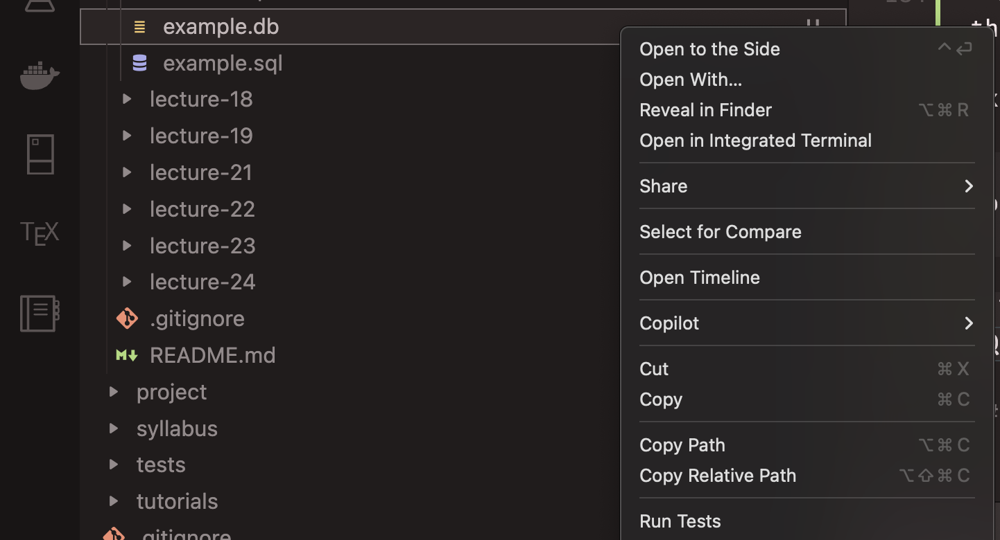

# Introduction

In Lectures 11 to 13, we will use [SQL](https://en.wikipedia.org/wiki/SQL) to work with databases. This tutorial helps you set up everything you need before Lecture 11, so we can start writing queries right away in class. Please do [Tutorial 01](01-vscode-anaconda-tutorial.qmd) first, as you will need VS Code and Anaconda installed.

You will set up three things:

1. The `sqlite3` module in Python, which comes with Anaconda, so you only need to check that it works
2. The SQLite3 Editor extension for VS Code, which lets you see and edit databases without writing code
3. The `sqlite3` command-line tool (optional), which lets you run SQL in the terminal

# What is SQLite?

[SQLite](https://www.sqlite.org/) is a database system that saves the whole database in a single file on your computer. You do not need to install or run a database server, which makes SQLite very easy to use. It is also one of the most widely used databases in the world: your phone and your web browser use it every day.

People sometimes say that SQLite is "not a real database" because it is just one file. That is not true: SQLite can store far more data than you will ever need in this course. The SQL you learn with SQLite also works, with small differences, in other systems such as PostgreSQL and MySQL.

# Step 1: check Python's `sqlite3` module

Python comes with a module called `sqlite3`, so you do not need to install anything. We will use it in Lectures 12 and 13. To check that it works, open a terminal in VS Code ("View" > "Terminal") and run:

```bash
python -c "import sqlite3; print(sqlite3.sqlite_version)"
```

You should see a version number, such as `3.50.2`. The exact number does not matter. On Windows, please run this command in the Anaconda PowerShell Prompt (see [Tutorial 04](04-conda-environments-tutorial.qmd)).

# Step 2: install SQLite3 Editor in VS Code

[SQLite3 Editor](https://marketplace.visualstudio.com/items?itemName=yy0931.vscode-sqlite3-editor) is a VS Code extension that opens database files like a spreadsheet. You can create tables, add and edit rows, run SQL queries and export data to CSV, all inside VS Code. We will use it in Lecture 11.

To install it:

- Click on the Extensions icon on the left sidebar of VS Code (it looks like four squares)
- Search for "SQLite3 Editor"
- Find the extension by yy0931 and click on "Install"



## Create your first database

Let us check that the extension works:

- In VS Code, click on "File" > "New File" and save the file as `example.db`
- Click on `example.db` in the file explorer on the left. VS Code will open it with SQLite3 Editor



If VS Code opens the file as text instead, right-click on `example.db`, select "Open With..." and choose "SQLite3 Editor".

Now type the following query in the editor's query box at the bottom and run it:

```sql
CREATE TABLE students (
    id INTEGER PRIMARY KEY,
    name TEXT,
    age INTEGER
);
```

You should see a new, empty table called `students`. That is all you need for Lecture 11!

# Step 3 (optional): the `sqlite3` command-line tool

You do not need this tool for the course, as we will use Python and SQLite3 Editor in class. But it is useful if you want to run SQL in the terminal.

## macOS

SQLite comes with macOS. Open a terminal and type:

```bash
sqlite3 --version
```

You should see a version number. To open the SQLite prompt, type `sqlite3`. To leave it, type `.quit` and press Enter.

## Windows

The easiest way is to install SQLite with conda. Open the Anaconda PowerShell Prompt and run:

```bash
conda install sqlite -y
```

Anaconda may already include it, in which case conda will tell you that there is nothing to install. Then check that it works:

```bash
sqlite3 --version
```

To open the SQLite prompt, type `sqlite3`. To leave it, type `.quit` and press Enter.

You can also download SQLite from the [official website](https://www.sqlite.org/download.html), but then you have to add it to your system's PATH yourself, so I recommend the conda option.

## Linux

Most Linux distributions include SQLite. If yours does not, install the `sqlite3` package with your package manager, for example `sudo apt install sqlite3` on Ubuntu.

# Further resources

- [SQLite documentation](https://www.sqlite.org/docs.html)
- [The `sqlite3` command-line tool](https://www.sqlite.org/cli.html)
- [Python's `sqlite3` tutorial](https://docs.python.org/3/library/sqlite3.html#sqlite3-tutorial)
- [SQLBolt](https://sqlbolt.com/), with short interactive SQL lessons you can do in your browser

If you have any problems with the installation, please email me at <danilo.freire@emory.edu> before Lecture 11, so we can fix them before class. Happy querying! :)
