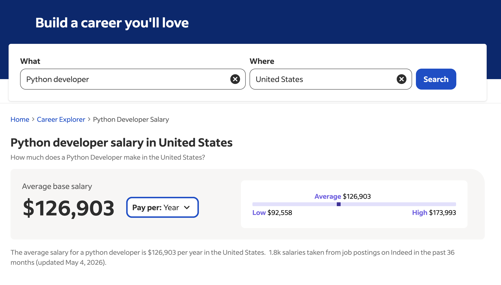
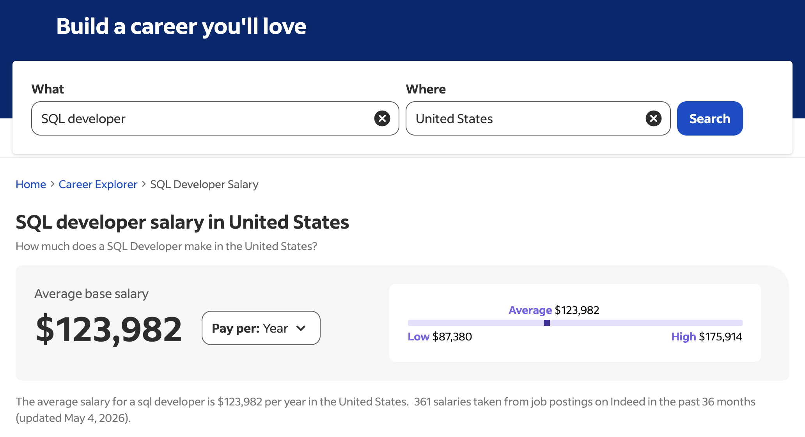
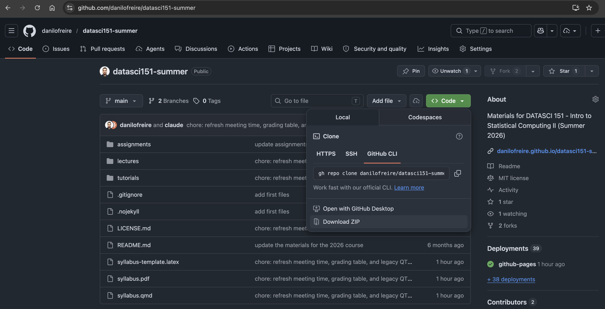

```{r}
#| echo: false
#| results: hide
knitr::opts_chunk$set(echo = TRUE)
# Function to check if a package is installed, and install it if not
install_if_missing <- function(package) {
  if (!require(package, character.only = TRUE)) {
    install.packages(package, dependencies = TRUE)
    library(package, character.only = TRUE)
  }
}

# List of packages to ensure are installed and loaded
packages <- c("fontawesome")

# Apply the function to each package
lapply(packages, install_if_missing)
```

# Welcome to DATASCI 151! 🥳 {background-color="#2d4563"}

## Lecture overview

:::{style="font-size: 33px; margin-top: 50px;"}
:::{.columns}
:::{.column width=60%}
- [Introduction]{.alert}: Hello everyone! 🙋🏻
- [Motivation]{.alert}: Why learn Python and SQL?
- [Class Logistics]{.alert}: Course objectives, grading, and late policy
- [Computing Set up]{.alert}: Anaconda, Jupyter, VSCode
:::

:::{.column width=40%}
:::{style="text-align: center;, margin-top: -20px;"}
[{width="100%"}](#){data-modal-type="image" data-modal-url="figures/dark-side.jpg"}
:::
:::
:::
:::

## Course materials

### Important links

::: {style="font-size: 28px;"}
`r fa('globe')` Course website: <https://danilofreire.github.io/datasci151-summer>

`r fa('github')` Course repository: <https://github.com/danilofreire/datasci151-summer>

- This course is hosted on [GitHub](https://github.com), where you will find lecture materials, code samples, our discussion space, tutorials, and assignments. 
- Canvas will be used for course management, including assignment submissions, grades, and announcements. Please familiarise yourself with both platforms, and reach out if you have any questions.

::: {.callout-note}
Please remember to check the course website regularly for updates and announcements 😉
:::
:::

# Nice to meet you! 👋 {background-color="#2d4563"}

## Instructor

### A bit about me

:::: {.columns}
::: {.column}


::: {style="font-size: 26px;"}
`r fa('envelope')` [danilo.freire@emory.edu](mailto:danilo.freire@emory.edu)

`r fa('globe')` <https://danilofreire.github.io/>
:::
:::

::: {.column}
::: {style="font-size: 24px;"}
`r fa('chalkboard-user')` Visiting Assistant Professor in the [Department of Data and Decision Sciences](https://datascience.emory.edu/index.html)

`r fa('graduation-cap')` MA from the Graduate Institute Geneva, PhD from King's College London, Postdoc at Brown University, Senior Lecturer at the University of Lincoln, UK

`r fa('book-open')` Research interests: computational social science, experimental methods, policy evaluation, political violence, organised crime

`r fa('school')` I also teach [DATASCI 101 - Introduction to AI Applications](https://danilofreire.github.io/datasci101), [DATASCI 350 - Data Science Computing](https://danilofreire.github.io/datasci350), and [DATASCI 385 - Experimental Methods](https://danilofreire.github.io/datasci385)
:::
:::
::::

## {background-image="figures/neymar.jpg" background-size="100%"}

## {background-image="figures/carnaval.jpg" background-size="100%"}

## {background-image="figures/sp.jpg" background-size="100%"}

## {background-image="figures/montblanc.jpg" background-size="100%"}

## {background-image="figures/buzz.webp" background-size="100%"}

## {background-image="figures/moonwatch.jpg" background-size="100%"}

## My teaching philosophy
### What you can expect from me

<br>

:::{.incremental}
- I love teaching and aim to [make learning fun!]{.alert} 😄 
- Classes where [students participate are the best]{.alert}
- [Hands-on activities]{.alert} help you learn better
- I am always available to help and answer questions. [And I mean it!]{.alert}
- Feel free to ask questions during class, office hours, or via email 😉
:::

## Office hours: what for and what not for

<br>

- What office hours are meant for:
  - Applying tools in practice
  - Discussion of issues related to the assignments
  - Boosting your knowledge of data science

. . . 

- What these sessions are [not]{.alert} meant for: 
    - Solving the assignments for you
    - Taking care of developing your coding skills

## Class etiquette

:::: {.columns}
::: {.column width=70%}
- Coding can be tough and push you out of your comfort zone. If the course pace is too fast, let me know. I expect your commitment, but [I do not want anyone to fail]{.alert}
- You are all keen on data science, but your backgrounds vary. That is great! Some sessions might be more engaging than others. If you are bored, [help others]{.alert} or explore new data science areas
- [Always be respectful]{.alert} to each other
- [Ask questions]{.alert} whenever you need to!
:::

::: {.column width=30%}
[](#){data-modal-type="image" data-modal-url="figures/stupid-questions.jpg"}
:::
::::

# Why Python and SQL? 🐍🗄️ {background-color="#2d4563"}

## Why Python
### The world's most popular programming language

::: {layout-ncol=2}
[](#){data-modal-type="image" data-modal-url="figures/career.jpg"}

[](#){data-modal-type="image" data-modal-url="figures/popularity.jpg"}
:::

## Why Python
### Great community and easy to learn

:::: {.columns}
::: {.column width=43%}
There are thousands of Python user groups worldwide 

The Python community is very active and welcoming!
[](#){data-modal-type="image" data-modal-url="figures/python-meetup.png"}
:::

::: {.column width=57%}
- Java: 

::: {style="font-size: 24px;"}
```{verbatim}
public class Welcome {
    public static void main(String[] args) {
        System.out.println("Welcome to DATASCI 151!");
    }
}
```
:::

- Python:
```{python}
#| eval: false
#| output: false
#| python.reticulate: false
print("Welcome to DATASCI 151!")
```

Much easier! 😃
:::
::::

## Why Python
### Salaries are good!

:::{style="text-align: center;"}
[{width="90%"}](#){data-modal-type="image" data-modal-url="figures/salary.png"}
:::

## Why SQL
### The world's most popular database language

:::: {.columns}
::: {.column width=50%}
- SQL is the standard language for relational database management systems
- Easy to learn
- Standardised
- Manage huge amounts of data
- Widely used in industry
- Great for data analysis
:::

::: {.column width=50%}
[{width=400px}](#){data-modal-type="image" data-modal-url="figures/sql.png"}
[{width=400px}](#){data-modal-type="image" data-modal-url="figures/sqlite.png"}
:::
::::

## Why SQL
### Salaries are good too!

:::{style="text-align: center;"}
[{width="90%"}](#){data-modal-type="image" data-modal-url="figures/sql-salary.png"}
:::

# Course logistics 📚 {background-color="#2d4563"}

## Course objectives

1. Perform basic operations and write functions in Python
2. Conduct data wrangling and manipulate data using Python libraries such as Pandas
3. Merge and manage databases using SQL
4. Create visualisations to effectively communicate data insights
5. Implement linear models and understand the principles of time series analysis
6. Use Jupyter Notebooks for reproducible research
7. Develop problem-solving skills relevant to data analysis and statistical computing

## Grades and late policy

:::{style="font-size: 30px; margin-top: 30px;"}
::: {.columns}
::: {.column width=50%}
- Assignments (x5): [50%]{.alert}​
  - Practice class concepts​

- Quizzes (x3): [50%]{.alert}​
  - Questions are based on the lecture notes and assignments
  - Quizzes are open-book and open-notes (including the internet)

:::

::: {.column width=50%}
- All materials are available on the course website​ and GitHub​ repository
- Late assignments will automatically be graded for half-credit​
- Watch out for the assignments to install software. You will need these to be able to use the lectures notes
:::
:::
:::

# Computing set up 🖥️ {background-color="#2d4563"}

## Our class in a nutshell

[](#){data-modal-type="image" data-modal-url="figures/nutshell.png"}

## Installing Python using Anaconda
### Anaconda has all the libraries we need

<br>

- Follow the instructions [on our GitHub website](https://danilofreire.github.io/datasci151-summer/tutorials/01-vscode-anaconda-tutorial.html) 
- Or just go to <https://www.anaconda.com/download/success?reg=skipped> and download the version for your operating system
- We are using Anaconda virtual environments for this class (I will cover this in more detail soon)​
- For now: Anaconda comes with a full Python installation​ with everything you need to follow along with the course 

::: {.incremental}
- [Questions?]{.alert}
:::

## Installing VSCode and connecting Anaconda​
### Let's do it together!

:::{style="font-size: 26px; margin-top: 30px;"}
:::: {.columns}
::: {.column width=50%}
[Install VSCode]{.alert}

- Follow our [step-by-step tutorial](https://github.com/danilofreire/datasci151-summer/blob/main/tutorials/01-vscode-anaconda-tutorial.pdf) on GitHub
- Or download VSCode directly at <https://code.visualstudio.com/download> (Windows, Mac, or Linux)
- Find the [Extensions]{.alert} icon in the left sidebar (four small squares with one offset), or press `Ctrl+Shift+X` (`Cmd+Shift+X` on Mac)
- Install the [Jupyter](https://marketplace.visualstudio.com/items?itemName=ms-toolsai.jupyter) and [Python](https://marketplace.visualstudio.com/items?itemName=ms-python.python) extensions for VSCode
:::

::: {.column width=50%}
[Connect to Anaconda]{.alert}

- In VSCode, open "View" → "Command Palette"
- Type ["Python: Select Interpreter"]{.alert} and pick your Anaconda environment
- Use ["base"]{.alert} (Anaconda's default environment) for this course
:::
::::

<br>

Next class: we will create a course folder and open our GitHub materials in VSCode
:::

# Git and GitHub 🐙{background-color="#2d4563"}

## Git and GitHub

:::{style="font-size: 24px; margin-top: 30px;"}
:::{.columns}
:::{.column width=50%}
- [Git](https://git-scm.com/) is a [version control system](https://en.wikipedia.org/wiki/Version_control) for tracking code changes and collaborating with others
- Think Google Docs plus Microsoft Word's track changes, but for code (and far more powerful!)
- [GitHub](https://github.com/) is a web platform built on Git for sharing code and collaborating on projects
- It is also a social network for developers: follow others, star projects, contribute to open source
- Get a free student account: <https://github.com/education/students>
:::

:::{.column width=50%}
:::{style="margin-top: -30px; text-align: center;"}
[{width=80%}](#){data-modal-type="image" data-modal-url="figures/github.png"}
[{width=80%}](#){data-modal-type="image" data-modal-url="figures/git.png"}
:::
:::
:::
:::

## {background-image="figures/github01.png" background-size="100%"}

## How to download the course materials

:::{style="font-size: 25px; margin-top: 30px;"}
:::{.columns}
:::{.column width=50%}
- Go to the course repository: <https://github.com/danilofreire/datasci151-summer>
- Click on the green "Code" button and then "Download ZIP"
- Unzip the file and open the folder in VSCode
- You can add the folder to your VSCode workspace for easy access to the materials
  - In VSCode, click on "File" and then "Add Folder to Workspace"
  - Select the folder you just downloaded and click "Add"
:::

:::{.column width=50%}
:::{style="margin-top: -30px; text-align: center;"}
[{width=100%}](#){data-modal-type="image" data-modal-url="figures/github02.png"}

<https://github.com/danilofreire/datasci151-summer>
:::
:::
:::
:::

# Jupyter Notebooks 📘 {background-color="#2d4563"}

## Jupyter Notebooks

:::{style="font-size: 24px; margin-top: 30px;"}
:::{.columns}
:::{.column width=40%}
- [Jupyter Notebooks](https://jupyter.org/) are a great way to combine code, text, and visualisations!
- If you have used [R Markdown](https://rmarkdown.rstudio.com/), you will find Jupyter Notebooks very similar
- They are widely used in data science and machine learning, and are a great way to share your work with others
- Please install the [Jupyter extension](https://marketplace.visualstudio.com/items?itemName=ms-toolsai.jupyter) for VSCode
:::

:::{.column width=60%}
:::{style="margin-top: -30px; text-align: center;"}
[](#){data-modal-type="image" data-modal-url="figures/jupyter.png"}

- If you are using Anaconda, Jupyter Notebooks should be installed by default. If not, you can install it using the Anaconda Navigator or the command line

```{verbatim}
conda install jupyter
```
:::
:::
:::
:::

## Jupyter Notebooks

:::{style="font-size: 23px; margin-top: 30px;"}

:::{.columns}
:::{.column width=40%}
- We will use Jupyter Notebooks a lot for our classes!
- Quizzes and assignments will be in this format
- Our website has [a tutorial on how to use them too](https://danilofreire.github.io/datasci151-summer/tutorials/02-jupyter-markdown-tutorial.html)
- There are both Jupyter Notebooks and lecture notes for each class in the course repository
- So you can choose which one you prefer to use, or use both!
- Lecture notes are designed to be followed along, and there will be many "try it yourself" exercises throughout the lectures!
:::

:::{.column width=60%}
- In case you have any trouble with the installation, you can also use an online version of Jupyter Notebooks included in our website: <https://danilofreire.github.io/datasci151-summer/>
- Just click on ["Jupyter Lite"]{.alert} and it will open a Jupyter Notebook in your browser

:::{style="margin-top: -30px; text-align: center;"}
[{width=80%}](#){data-modal-type="image" data-modal-url="figures/jupyterlite.png"}
:::
:::
:::
:::

## Next class

:::{style="font-size: 28px;"}
- Let me know if you have any questions about the course or the material or how to set up your computer
- We will start with the basics of Jupyter Notebooks
- We will also cover the basics of Anaconda and VSCode
- Please remember to check the course repository and the website at <https://github.com/danilofreire/datasci151-summer> and <https://danilofreire.github.io/datasci151-summer>
- And please do not forget:
  - Coding ability can be developed
  - Academic skills and abilities are acquired through hard work, mistakes, and perseverance. Coding is no different
  - My only goal here is that you learn the material. Please ask me questions! 😉
:::

# Questions? {background-color="#2d4563"}

# Thank you very much for your attention! 🙏🎉 {background-color="#2d4563"}
